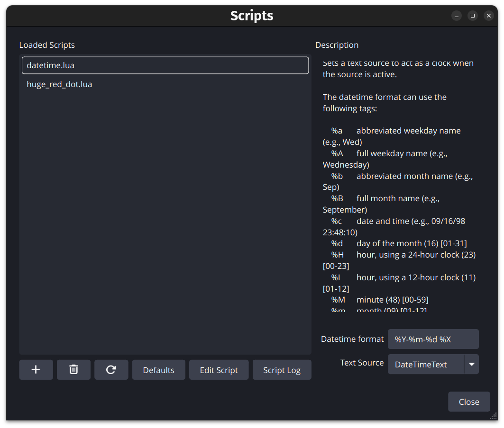

# datetime_obs_plugin

An OBS Studio Lua script that updates a text source with the current date and
time. The format uses Lua `os.date` tokens, so the same script can display a
clock, a date, or both.

## Usage

1. In OBS Studio, create a text source in the scene where you want the date or
   time to appear.
   - On Windows, use a `Text (GDI+)` source.
   - On Linux and macOS, use a `Text (FreeType 2)` source.
2. Open `Tools -> Scripts`.
3. In the `Lua Scripts` tab, click the `+` button and select `datetime.lua`.
4. Select the loaded `datetime.lua` script.
5. Set `Text Source` to the OBS text source you created.
6. Set `Datetime format` to the date/time format you want.

The text source updates once per second while the source is visible in OBS.

## Attribution

Inspired by OBS Studio's bundled
[`clock-source.lua`](https://github.com/obsproject/obs-studio/blob/master/plugins/frontend-tools/data/scripts/clock-source.lua)
example. That script was originally added by
[Colin Edwards / DDRBoxman](https://github.com/DDRBoxman) in
[obsproject/obs-studio@1c3f18a](https://github.com/obsproject/obs-studio/commit/1c3f18a75ac3e64e7452a4ba091c24c64b6e79d8)
and is maintained by the OBS Project.

## Format examples

| Format | Example output |
| --- | --- |
| `%Y-%m-%d %X` | `2026-07-13 21:34:08` |
| `%H:%M:%S` | `21:34:08` |
| `%I:%M:%S %p` | `09:34:08 PM` |
| `%A, %B %d, %Y` | `Monday, July 13, 2026` |

Common tokens:

| Token | Meaning |
| --- | --- |
| `%Y` | 4-digit year |
| `%m` | Month number |
| `%d` | Day of month |
| `%H` | Hour, 24-hour clock |
| `%I` | Hour, 12-hour clock |
| `%M` | Minute |
| `%S` | Second |
| `%p` | AM or PM |
| `%A` | Full weekday name |
| `%B` | Full month name |
